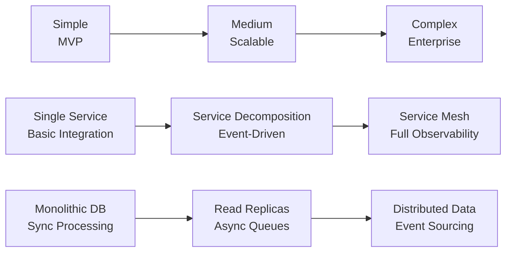
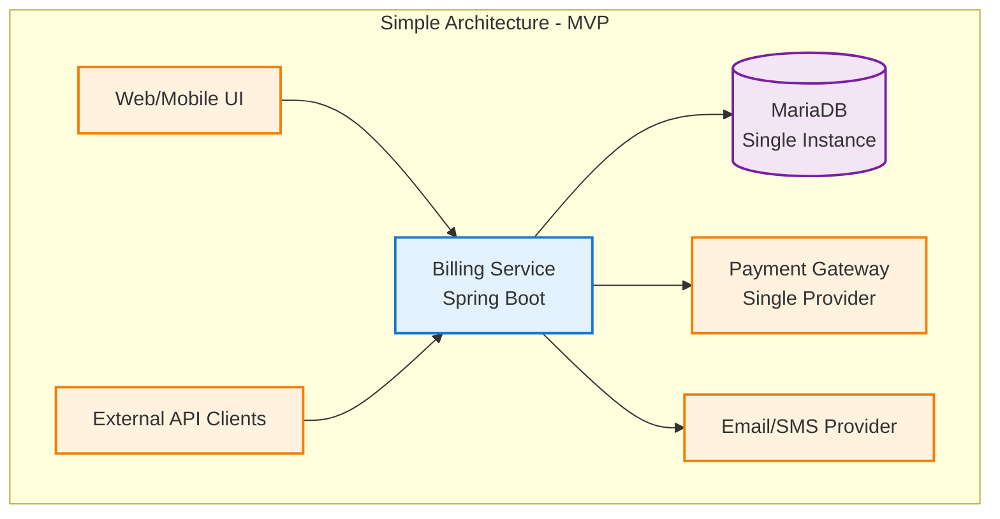
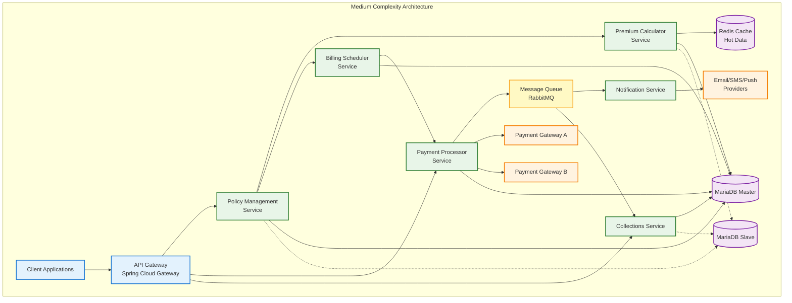
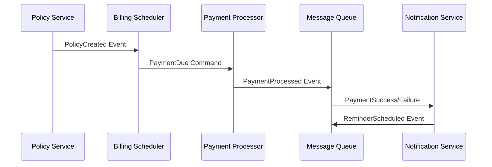
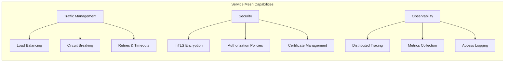
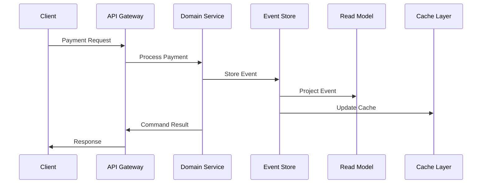
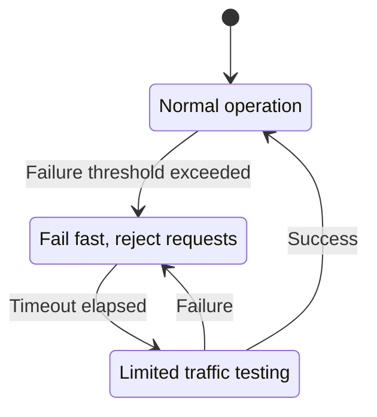
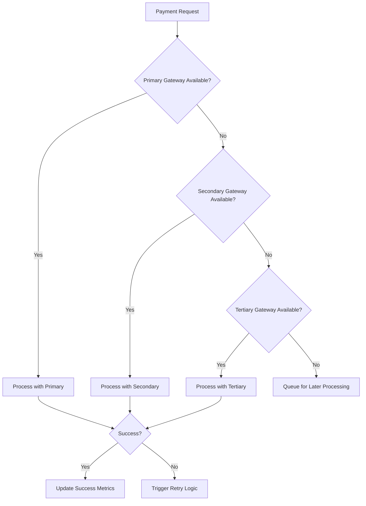
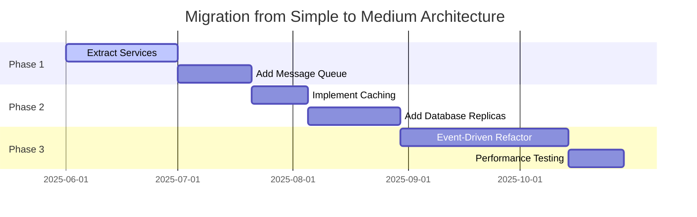
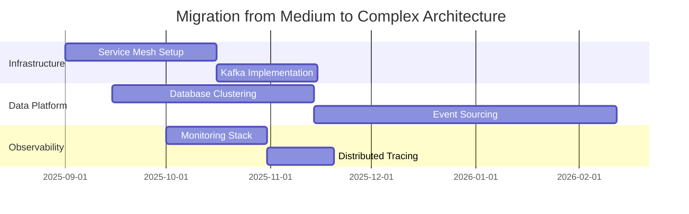

# Architecture Diagrams and Design Progression

> **Document Purpose**: Visual representation of three progressive architecture approaches for the policy billing and collections microservice, from simple MVP to enterprise-scale solutions.

---

## 🏗️ Architecture Evolution Overview

The system design follows a progressive complexity model, allowing organizations to start simple and evolve toward enterprise-grade architecture as requirements and scale demand. Each level builds upon the previous while maintaining backward compatibility and migration pathways.

### Evolution Strategy



---

## 🟦 Simple Architecture (MVP Level)

> **Target**: Proof of concept, small-scale deployment (1K-10K policies)  
> **Timeline**: 2-4 months development  
> **Team Size**: 2-4 developers  

### Architecture Diagram



### Key Characteristics

| **Aspect** | **Implementation** | **Limitations** |
|------------|-------------------|-----------------|
| **Service Design** | Monolithic Spring Boot application | Single point of failure, tight coupling |
| **Data Management** | Single MariaDB instance | No redundancy, limited scalability |
| **Payment Processing** | Single payment gateway integration | No failover, vendor lock-in |
| **Notifications** | Synchronous email/SMS dispatch | Blocking operations, no retry logic |
| **Deployment** | Single-server deployment | No load balancing, manual scaling |

### Suitable For
- ✅ MVP development and validation
- ✅ Small customer base (< 10K policies)
- ✅ Single geographic region
- ✅ Proof of concept demonstrations
- ❌ Production enterprise workloads

---

## 🟨 Medium Complexity Architecture (Scalable)

> **Target**: Growing business with moderate scale (10K-100K policies)  
> **Timeline**: 4-8 months development  
> **Team Size**: 6-10 developers  

### Architecture Diagram



### Enhanced Capabilities

#### Event-Driven Processing Flow


### Infrastructure Improvements

| **Component** | **Enhancement** | **Benefit** |
|---------------|-----------------|-------------|
| **Caching** | Redis cluster for hot data | 10x faster policy lookups |
| **Database** | Master/slave replication | Read scaling, backup recovery |
| **Messaging** | RabbitMQ with retry logic | Reliable async processing |
| **Load Balancing** | Service-level load balancing | Even distribution, failover |

---

## 🟪 Complex Enterprise Architecture

> **Target**: Large-scale enterprise (100K+ policies, multi-region)  
> **Timeline**: 8-18 months development  
> **Team Size**: 15-25 developers  

### High-Level Architecture Overview

```mermaid
graph TB
    subgraph "Client Layer"
        WEB[Web Applications]
        MOBILE[Mobile Apps]
        PARTNERS[Partner Systems]
    end
    
    subgraph "API & Service Mesh"
        API_GW[API Gateway<br/>Kong/AWS ALB]
        SERVICE_MESH[Service Mesh<br/>Istio]
    end
    
    subgraph "Core Domain Services"
        POLICY_SVC[Policy Domain<br/>Service]
        PREMIUM_ENG[Premium Calculation<br/>Engine]
        BILLING_ORCH[Billing<br/>Orchestrator]
        PAYMENT_SVC[Payment Processing<br/>Service]
        COLLECTION_SVC[Collections<br/>Management]
        NOTIFICATION_HUB[Notification<br/>Hub]
    end
    
    subgraph "Event Streaming Platform"
        KAFKA[Apache Kafka<br/>Event Backbone]
        EVENT_STORE[Event Store<br/>Audit Trail]
    end
    
    subgraph "Data Platform"
        DB_CLUSTER[(MariaDB Cluster<br/>Multi-Master)]
        REDIS_CLUSTER[(Redis Cluster<br/>Distributed Cache)]
        SEARCH[ElasticSearch<br/>Analytics)]
    end
    
    subgraph "External Ecosystem"
        PAYMENT_GWS[Multiple Payment<br/>Gateways]
        NOTIFICATION_PROVIDERS[Notification<br/>Providers]
        THIRD_PARTY[Third-party<br/>Services]
    end
    
    %% Connections
    WEB --> API_GW
    MOBILE --> API_GW
    PARTNERS --> API_GW
    API_GW --> SERVICE_MESH
    SERVICE_MESH --> POLICY_SVC
    SERVICE_MESH --> PREMIUM_ENG
    SERVICE_MESH --> BILLING_ORCH
    SERVICE_MESH --> PAYMENT_SVC
    SERVICE_MESH --> COLLECTION_SVC
    SERVICE_MESH --> NOTIFICATION_HUB
    
    POLICY_SVC --> KAFKA
    PREMIUM_ENG --> KAFKA
    BILLING_ORCH --> KAFKA
    PAYMENT_SVC --> KAFKA
    COLLECTION_SVC --> KAFKA
    NOTIFICATION_HUB --> KAFKA
    
    KAFKA --> EVENT_STORE
    
    POLICY_SVC --> DB_CLUSTER
    PREMIUM_ENG --> REDIS_CLUSTER
    PAYMENT_SVC --> DB_CLUSTER
    COLLECTION_SVC --> SEARCH
    
    PAYMENT_SVC --> PAYMENT_GWS
    NOTIFICATION_HUB --> NOTIFICATION_PROVIDERS
    COLLECTION_SVC --> THIRD_PARTY
    
    %% Styling
    classDef serviceBox fill:#e8f5e8,stroke:#2e7d32,stroke-width:2px
    classDef dataBox fill:#f3e5f5,stroke:#7b1fa2,stroke-width:2px
    classDef externalBox fill:#fff3e0,stroke:#f57c00,stroke-width:2px
    classDef infraBox fill:#e3f2fd,stroke:#1976d2,stroke-width:2px
    classDef eventBox fill:#fff9c4,stroke:#f9a825,stroke-width:2px
    
    class POLICY_SVC,PREMIUM_ENG,BILLING_ORCH,PAYMENT_SVC,COLLECTION_SVC,NOTIFICATION_HUB serviceBox
    class DB_CLUSTER,REDIS_CLUSTER,SEARCH dataBox
    class PAYMENT_GWS,NOTIFICATION_PROVIDERS,THIRD_PARTY,WEB,MOBILE,PARTNERS externalBox
    class API_GW,SERVICE_MESH infraBox
    class KAFKA,EVENT_STORE eventBox
```

### Enterprise Capabilities Deep Dive

#### 1. Service Mesh Benefits


#### 2. Event Sourcing Pattern


#### 3. Data Architecture Strategy

| **Data Type** | **Storage Strategy** | **Access Pattern** | **Consistency Model** |
|---------------|---------------------|-------------------|----------------------|
| **Transactional** | MariaDB Cluster | Strong consistency | ACID compliance |
| **Cache** | Redis Cluster | Eventually consistent | Write-through/behind |
| **Events** | Kafka + Event Store | Immutable log | Append-only |
| **Analytics** | ElasticSearch | Near real-time | Eventually consistent |
| **Files/Documents** | Object Storage | Archival access | Strong consistency |

### Enterprise Integration Patterns

#### Circuit Breaker Implementation


#### Payment Gateway Failover Strategy


---

## 📊 Architecture Comparison Matrix

### Capability Comparison

| **Capability** | **Simple** | **Medium** | **Complex** |
|----------------|------------|------------|-------------|
| **Scalability** | Single instance | Horizontal services | Auto-scaling cluster |
| **Availability** | 95% | 99% | 99.9%+ |
| **Data Consistency** | Strong | Eventually consistent | Configurable per use case |
| **Monitoring** | Basic logging | Metrics + alerts | Full observability stack |
| **Security** | Basic auth | API gateway security | mTLS + zero trust |
| **Deployment** | Manual | CI/CD pipeline | GitOps + blue/green |
| **Disaster Recovery** | Manual backup | Automated backup | Multi-region replication |

### Development & Operational Complexity

```mermaid
radar
    title Architecture Complexity Assessment
    options
      max: 10
      x-axis: [Development Speed, Operational Overhead, Learning Curve, Maintenance Cost, Feature Velocity, Scaling Capability, Fault Tolerance, Security Posture]
    
    bar [9, 2, 2, 3, 8, 2, 3, 4]
    bar [6, 5, 5, 5, 6, 6, 6, 6]
    bar [3, 8, 8, 8, 4, 9, 9, 9]
```

### Migration Pathways

#### Simple → Medium Migration


#### Medium → Complex Migration


---

## 🎯 Decision Framework

### When to Choose Each Architecture

#### Choose **Simple** When:
- 🎯 Building MVP or proof of concept
- 👥 Small team (2-4 developers)
- 📊 Low transaction volume (< 1K daily)
- ⏱️ Time to market is critical
- 💰 Limited budget for infrastructure

#### Choose **Medium** When:
- 📈 Growing business with scaling needs
- 👥 Medium team (6-10 developers)
- 📊 Moderate transaction volume (1K-50K daily)
- 🔄 Need for service independence
- 💪 Moderate fault tolerance requirements

#### Choose **Complex** When:
- 🏢 Enterprise-scale requirements
- 👥 Large engineering organization
- 📊 High transaction volume (50K+ daily)
- 🌍 Multi-region deployment needs
- 🛡️ Stringent compliance requirements
- 💼 Mission-critical availability needs

---

*Document Version: 1.0*  
*Last Updated: May 30, 2025*  
*Next Review: June 30, 2025*