# System Assumptions and Design Foundations

> **Document Purpose**: Establish foundational assumptions about traffic patterns, system behavior, and architectural constraints that drive design decisions for the policy billing and collections microservice.

---

## 📊 Traffic Volume and Scale Assumptions

### Policy Portfolio Characteristics

| **Metric** | **Assumption** | **Rationale** |
|------------|----------------|---------------|
| **Active Policies** | 100K - 1M policies | Mid-size insurance carrier baseline |
| **Billing Distribution** | 80% Monthly, 15% Quarterly, 5% Annual | Industry standard payment preferences |
| **Policy Lifecycle** | 6-24 months average duration | Typical auto/property insurance terms |
| **Geographic Distribution** | 70% Domestic, 30% International | Multi-market insurance operations |

### Billing Cycle Patterns

#### Peak Processing Windows
- **Primary Peaks**: 1st and 15th of each month (2-3x normal volume)
- **Month-End Surge**: 60% of monthly volume in final 3 days
- **Seasonal Variations**: 20% increase during renewal periods (Q1, Q4)

#### Daily Transaction Volumes
```
┌─────────────────────┬──────────────┬──────────────┐
│ Operation Type      │ Daily Volume │ Peak Volume  │
├─────────────────────┼──────────────┼──────────────┤
│ Premium Calculations│ 3K - 30K     │ 90K          │
│ Payment Attempts    │ 2K - 20K     │ 60K          │
│ Notification Events │ 500 - 5K     │ 15K          │
│ Status Updates      │ 1K - 10K     │ 30K          │
└─────────────────────┴──────────────┴──────────────┘
```

---

## 💳 Payment Behavior and Success Patterns

### Payment Method Distribution


### Payment Success Rates

| **Attempt** | **Success Rate** | **Cumulative Success** | **Processing Time** |
|-------------|------------------|------------------------|---------------------|
| **First Attempt** | 85% | 85% | < 30 seconds |
| **Second Attempt** | 60% of failures (9%) | 94% | < 2 minutes |
| **Third Attempt** | 20% of remaining (1.2%) | 95.2% | < 5 minutes |
| **Collections** | 4.8% of total | 100% | Days to weeks |

### Grace Period Utilization
- **40%** of failed payments use the full grace period
- **Average grace period**: 15 days
- **Retry schedule**: Days 1, 3, 7, 15

---

## 🔄 System Flow and Processing Patterns

### Critical Path Operations
> **Response Time Requirement**: Sub-second

- ✅ **Payment Authorization**: Real-time validation and capture
- ✅ **Policy Status Updates**: Immediate status synchronization
- ✅ **Payment Method Validation**: Live verification with providers
- ✅ **Fraud Detection Checks**: Real-time risk assessment

### Batch-Acceptable Operations
> **Response Time Requirement**: Minutes to hours

- 📊 **Premium Recalculations**: Nightly batch processing
- 📈 **Delinquency Reporting**: Daily aggregation and analysis
- 📧 **Bulk Notification Dispatch**: Scheduled reminder campaigns
- 🔄 **Data Synchronization**: Cross-system reconciliation

### Temporal Processing Distribution

```mermaid
gantt
    title Daily Processing Timeline
    dateFormat HH:mm
    axisFormat %H:%M
    
    section Critical Operations
    Payment Processing    :crit, active, 06:00, 22:00
    Real-time Updates     :crit, active, 00:00, 23:59
    
    section Batch Operations
    Premium Calculations  :batch, 02:00, 04:00
    Reporting Generation  :batch, 03:00, 05:00
    Data Reconciliation   :batch, 01:00, 02:00
    
    section Notification Windows
    Email Campaigns       :notify, 09:00, 11:00
    SMS Reminders         :notify, 10:00, 18:00
```



---

## 🗄️ Data Characteristics and Patterns

### Policy Metadata Complexity

| **Data Category** | **Characteristics** | **Update Frequency** |
|-------------------|---------------------|----------------------|
| **Rating Factors** | 5-15 variables per policy | Annually (renewals) |
| **Billing Preferences** | Payment method, frequency | 2% change annually |
| **Coverage Details** | Limits, deductibles, riders | 10-15% modify annually |
| **Risk Factors** | Location, history, demographics | Semi-annually |

### Data Volatility and Retention

#### Write Patterns
- **Policy Updates**: 10-15% of portfolio annually
- **Payment Records**: High volume, append-only
- **Event Logs**: Continuous streaming, high velocity
- **Billing History**: Immutable, long-term retention

#### Read Patterns
- **Hot Data** (Daily Access): Active policies, current billing cycles
- **Warm Data** (Weekly Access): Recent payment history, grace period tracking
- **Cold Data** (Monthly/Archival): Historical records, compliance data

---

## 🌍 Geographic and Regulatory Considerations

### Processing Time Zones

```mermaid
timeline
    title Global Payment Processing Windows
    
    section Asia Pacific
        22:00 UTC - 06:00 UTC : Primary processing window
                              : 40% of APAC volume
    
    section Europe/Africa  
        06:00 UTC - 14:00 UTC : Primary processing window
                              : 25% of global volume
    
    section Americas
        14:00 UTC - 22:00 UTC : Primary processing window
                              : 60% of global volume
```

### Regulatory Compliance Requirements
- **Payment Processing**: PCI DSS Level 1 compliance
- **Data Retention**: 7-year minimum for audit trails
- **Privacy Regulations**: GDPR, CCPA compliance for customer data
- **Financial Reporting**: Real-time reporting for regulatory bodies

---

## ⚡ Performance and Scalability Assumptions

### Response Time Targets

| **Operation Category** | **Target Response Time** | **95th Percentile** | **99th Percentile** |
|------------------------|--------------------------|---------------------|---------------------|
| **Payment Authorization** | < 500ms | < 1s | < 2s |
| **Premium Calculation** | < 2s | < 5s | < 10s |
| **Status Updates** | < 100ms | < 250ms | < 500ms |
| **Notification Dispatch** | < 30s | < 60s | < 120s |

### Scaling Thresholds

#### Horizontal Scaling Triggers
- **CPU Utilization**: > 70% sustained for 5 minutes
- **Memory Usage**: > 80% of allocated resources
- **Response Time**: > 95th percentile SLA breach
- **Queue Depth**: > 1000 pending messages

#### Database Scaling Considerations
- **Read Replicas**: Scale at 60% primary utilization
- **Connection Pooling**: 50-100 connections per service instance
- **Query Performance**: < 100ms for 95% of queries
- **Storage Growth**: 20-30% annually

---

## 🔧 Integration and Dependency Assumptions

### External Service Dependencies

| **Service Type** | **Availability SLA** | **Response Time** | **Failover Strategy** |
|------------------|---------------------|-------------------|----------------------|
| **Payment Gateways** | 99.9% | < 2s | Multiple provider failover |
| **Credit Bureaus** | 99.5% | < 5s | Cached data fallback |
| **Notification Providers** | 99.8% | < 10s | Provider rotation |
| **Legacy Systems** | 99.0% | < 30s | Event-driven sync |

### Service Mesh and Communication

#### Synchronous Communication
- **Service-to-Service**: gRPC for internal communications
- **Client-to-Service**: REST APIs via API Gateway
- **Database Access**: Connection pooling with retry logic

#### Asynchronous Communication
- **Event Streaming**: Kafka for high-volume events
- **Message Queues**: RabbitMQ for reliable delivery
- **Notifications**: Event-driven pub/sub patterns

---

## 📈 Growth and Evolution Projections

### 3-Year Growth Trajectory


| **Metric** | **Year 1** | **Year 2** | **Year 3** | **Growth Strategy** |
|------------|-------------|-------------|-------------|---------------------|
| **Policy Volume** | 100K | 250K | 500K | Horizontal scaling |
| **Daily Transactions** | 10K | 25K | 50K | Service decomposition |
| **Geographic Regions** | 2 | 4 | 6 | Multi-region deployment |
| **Payment Providers** | 3 | 6 | 10 | Plugin architecture |

---

## 🎯 Success Metrics and KPIs

### Business Metrics
- **Collection Rate**: > 95% within grace period
- **Payment Success Rate**: > 94% first attempt
- **Customer Satisfaction**: < 2% billing-related complaints
- **Processing Cost**: < $0.50 per transaction

### Technical Metrics
- **System Availability**: 99.9% uptime
- **Mean Time to Recovery**: < 15 minutes
- **Data Consistency**: 99.99% accuracy
- **Security Incidents**: Zero tolerance for data breaches

---

*Document Version: 1.0*  
*Last Updated: May 30, 2025*  
*Next Review: June 30, 2025*